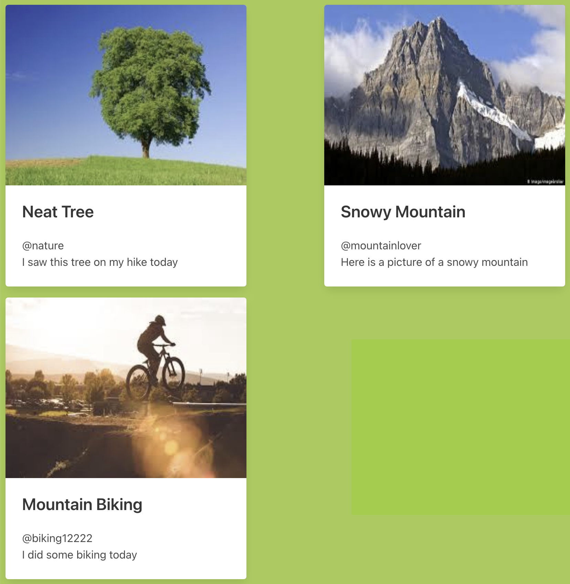

# Cards-Angular 

  ## Description

  A simple app build with the Angular.js framework that renders cards based on an array of data.
  
  Screenshot:
  

  ## Table of Contents
  
  - [Installation](#installation)
  - [Usage](#usage)
  - [License](#license)
  - [Contributing](#contributing)
  - [Tests](#tests)
  - [Questions](#questions)
  
  ## Installation
  
  deployed Url:  https://billstephens2022.github.io/Cards-Angular/
  
  ## Usage
  
  go to deployed URL to view:  https://billstephens2022.github.io/Cards-Angular/

  ## License
This application is covered under the MIT License.
 For more information: https://opensource.org/licenses/MIT
  
  ## Contributing
  N/A
  
  ## Tests
  N/A

  ## Questions
  Contact Info 
  GitHub user name: BillStephens2022 
  Link to GitHub profile: https://github.com/BillStephens2022 
  Email: stephensbill17@gmail.com
